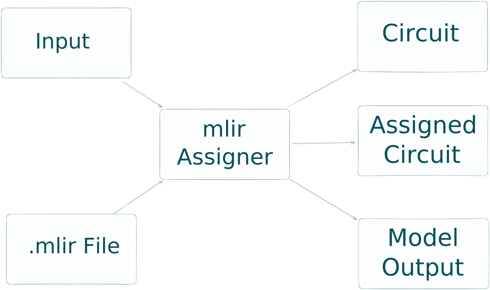

# ONNX zkML Frontend for zkLLVM

[](https://twitter.com/TACEO_IO)

This project extends the [zkLLVM](https://github.com/NilFoundation/zkLLVM)
compiler with an [ONNX](https://github.com/onnx/onnx#readme) frontend,
leveraging the
[ONNX-MLIR compiler technology](https://github.com/onnx/onnx-mlir). It allows
developers to compile and assign ZK circuits from their pre-trained `onnx`
models and proof them with the `Placeholder` proof system (see `zkLLVM`
documentation).

This project builds two binaries, namely:

- `zk-ml-opt` A compiler that lowers `.onnx` files. (name is subject to change)
- `mlir-assigner` A VM that interprets `.mlir` and produces a plonkish circuit
  and an assigned table.

We list the currently supported ONNX operations and limitations
[here](mlir-assigner/tests/README.md).

## Build

We heavily encourage to use the `nix` devshell when working with, or building
from source. It is possible to build the project on Linux (tested with Ubuntu
22.04), but the build process can be involved.

### Build in nix devshell

The included nix flake sets up a devshell with all dependencies for building the
`mlir-assigner`. Since it also fetches and builds the bundled LLVM in zkLLVM,
this may take some time, so we recommend to pass `--cores 16` or similar to the
initial invocation of `nix develop`.

```bash
nix develop # or
nix develop --cores 16 #allow the first-time build to use more cores for building the deps
# in the devshell
mkdir build && cd build
cmake -DMLIR_DIR=${MLIR_DIR} -DONNX_USE_PROTOBUF_SHARED_LIBS=ON ..
make -j
```

You can find the binaries in the `build/bin` folder.

### Build on Ubuntu 22.04

TODO

## Testing

To test your build, have a look in the [test folder](mlir-assigner/tests).

## Example

This section shows how to use the zkML frontend for zkLLVM. In this example, we
guide you through every step to proof the
[CNN-MNIST Model](https://github.com/onnx/models/tree/main/vision/classification/mnist)
from the ONNX model zoo on Ubuntu 22.04.

We expect that you already built the two binaries `build/bin/zk-ml-opt` and
`build/bin/mlir-assigner` from source or obtained them in another way. If not,
follow the [build instructions](#build).

1. **Setup:** We start by creating an empty folder here we place our binaries
   and our model. So when you built from source we do:

```bash
mkdir CNN-Mnist
cp build/bin/mlir-assigner CNN-Mnist && cp build/bin/zkml-onnx-compiler CNN-Mnist
cd CNN-Mnist
wget https://github.com/onnx/models/raw/main/vision/classification/mnist/model/mnist-12.onnx
```

In case you have another model you want to proof, use that instead of the
CNN-Mnist model.

2. **Compile ONNX to MLIR:** Having your pre-trained model at place, we use the
   `zkml-onnx-compiler` to compile the model to `.mlir`.
    You can do this by calling the
   `zkml-onnx-compiler`:

```bash
./zkml-onnx-compiler mnist-12.onnx -i mnist-12.mlir
```

> The `zkml-onnx-compiler` can also lower the model to different IRs. Have a
> look by adding the `--help` flag.

The emitted `.mlir` consists of the dialects defined by ONNX-MLIR and an
additional dialect defined by this project with the namespace `zkML`. This
dialect defines operations which need special handling in contrast to the
default lowering provided by ONNX-MLIR, e.g., as seen during the lowering of
[MatMuls](https://github.com/onnx/onnx/blob/main/docs/Operators.md#MatMul),
[Gemms](https://github.com/onnx/onnx/blob/main/docs/Operators.md#Gemm), or
[Convolutions](https://github.com/onnx/onnx/blob/main/docs/Operators.md#Conv).
Natively lowering matrix multiplications leads to polluted traces with a lot of
additions and multiplications. For that we introduced the operation
`zkml.Dot-Product` which improves performance drastically.

3. **Prepare your input:** The `mlir-assigner` expects the input for inference in `json` format. Have a look at e.g., [the input to this small model](mlir-assigner/tests/Ops/Add/AddSimple.json) to see how you should prepare your input. For this example, we have an input file prepared. Therefore, we just copy it to our folder:
```bash
cp ../mlir-assigner/tests/Models/ConvMnist/mnist-12.json .
```


4. **Perform inference and assign circuit:** The next step may take some time depending on your model. We have to perform inference of the model and the provided input within the plonkish arithmetization of the proof system. We do this by calling:
```bash
./mlir-assigner -b mnist-12.mlir -i mnist-12.json -e pallas -c circuit.crt -t assignment.tbl --print_circuit_output --check
```
You can find the unassigned circuit now in the file `circuit.crt` and the assignment in `assignment.tbl`, as you are used to from `zkLLVM`. We refer to the documentation from [zkLLVM](https://github.com/NilFoundation/zkLLVM#usage) on how to compute proofs.

