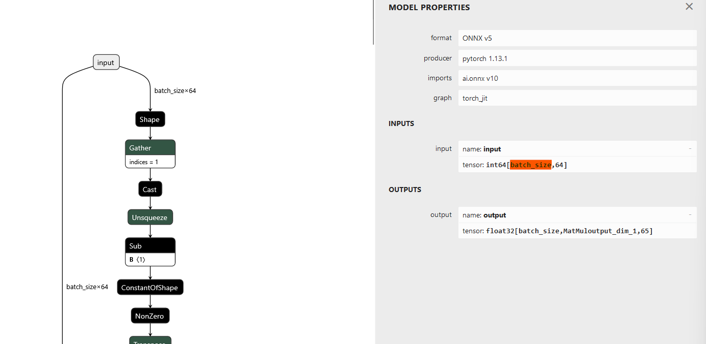

# ONNX zkML Frontend for zkLLVM

[](https://twitter.com/TACEO_IO)

This project expands the functionality of the
[zkLLVM](https://github.com/NilFoundation/zkLLVM) compiler by integrating an
[ONNX](https://github.com/onnx/onnx#readme) frontend, leveraging the
capabilities of the
[ONNX-MLIR compiler technology](https://github.com/onnx/onnx-mlir). It allows
developers to compile and assign ZK circuits based on their pre-trained ONNX
models and validate them using the Placeholder proof system (refer to the zkLLVM
documentation for more details).

### Included Binaries

This project includes two binaries:

- `zkml-onnx-compiler`: A compiler designed to lower .onnx files. (Note: The
  name of this compiler may be subject to change as the project evolves.)
- `mlir-assigner` An assigner responsible for interpreting .mlir dialect files
  and generating a plonkish circuit along with an assigned table.

### Supported Operations and Limitations:

We provide a comprehensive list of the ONNX operations currently supported by
our system, along with any limitations that may apply.

## Build

<!--  TODO Installation -->

We heavily encourage to use the `nix` devshell when working with, or building
from source. It is possible to build the project on Linux (tested with Ubuntu
22.04), but the build process can be involved.

### Nix Flake Setup:

Included in the project is a Nix flake that facilitates setting up a development
shell with all necessary dependencies for building the `mlir-assigner`. As part
of this setup process, the flake fetches and builds the bundled LLVM within
zkLLVM. As this is can be pretty time-consuming, we recommend passing the
`--cores 16` flag or a similar option during the initial invocation of
`nix develop`.

```bash
nix develop # or
nix develop --cores 16 #allow the first-time build to use more cores for building the deps
```

Once inside the Nix shell environment, proceed to the following steps:

```bash
mkdir build && cd build
cmake -DMLIR_DIR=${MLIR_DIR} ..
make -j
```

The resulting binaries can be located in the `build/bin` directory.

### Build on Ubuntu 22.04

For an optimal development environment setup, we strongly recommend utilizing
the `Nix` devshell. However, if you prefer to build on your native machine,
please follow the steps outlined below.

1. Download the source

```bash
git clone --recurse-submodules -j8 git@github.com:TaceoLabs/zkllvm-mlir-assigner.git && cd zkllvm-mlir-assigner
```

2. One of our dependencies is ONNX-MLIR (`libs/onnx-mlir`). Ensure that all
   [requirements and build instructions for ONNX-MLIR](https://github.com/onnx/onnx-mlir/tree/a04f518c1b0b8e4971d554c399bb54efc00b81db#setting-up-onnx-mlir-directly)
   are correctly set up. Although you don't need to build it explicitly,
   everything must be configured correctly. This includes having a build tree of
   MLIR (not ONNX-MLIR) as part of the LLVM project, as outlined
   [here](https://github.com/onnx/onnx-mlir/blob/a04f518c1b0b8e4971d554c399bb54efc00b81db/docs/BuildOnLinuxOSX.md).

3. Confirm that your environment variable `$MLIR_DIR` points to an MLIR CMake
   module by running:

   ```bash
   echo $MLIR_DIR
   ```

4. Setup cmake and build

   ```bash
   mkdir build && cd build
   cmake -DMLIR_DIR=${MLIR_DIR} ..
   make -j zkml-onnx-compiler mlir-assigner
   ```

## Usage

This section shows how to use the zkML frontend for zkLLVM. In this example, we
guide you through every step to proof the
[CNN-MNIST Model](https://github.com/onnx/models/tree/ddbbd1274c8387e3745778705810c340dea3d8c7/validated/vision/classification/mnist)
from the ONNX model zoo on Ubuntu 22.04.

We expect that you already built the two binaries `build/bin/zk-ml-opt` and
`build/bin/mlir-assigner` from source or obtained them in another way. If not,
follow the [build instructions](#build).

1. **Setup:** We start by creating an empty folder where we place our binaries
   and our model. So when you built from source we do:

   ```bash
   mkdir CNN-Mnist
   cp build/bin/mlir-assigner CNN-Mnist && cp build/bin/zkml-onnx-compiler CNN-Mnist
   cd CNN-Mnist
   wget https://github.com/onnx/models/raw/main/validated/vision/classification/mnist/model/mnist-12.onnx
   ```

   In case you have another model you want to proof, use that instead of the
   CNN-Mnist model.

2. **Compile ONNX to MLIR:** Having your pre-trained model at place, we use the
   `zkml-onnx-compiler` to compile the model to `.mlir`.

   

   When lowering to `.mlir` you also have to specify which inputs of the model
   are public/private by passing a comma seperated list to the `zk` flag (e.g.
   `--zk 1,1,0`). If an input is set to private, the produced Zero-Knowledge
   proof will not reveal the input.

   For instance, imagine we want to keep the single input to the mnist model we
   use (the picture of the digit) private. To achieve this, we call the compiler
   with the following command

   ```bash
   ./zkml-onnx-compiler mnist-12.onnx --output mnist-12.mlir --zk 1
   ```

   > The `zkml-onnx-compiler` can also lower the model to different IRs. Have a
   > look by adding the `--help` flag.

   The emitted `.mlir` consists of the dialects defined by ONNX-MLIR and an
   additional dialect defined by this project with the namespace `zkML`. This
   dialect defines operations which need special handling in contrast to the
   default lowering provided by ONNX-MLIR, e.g., as seen during the lowering of
   [MatMuls](https://github.com/onnx/onnx/blob/main/docs/Operators.md#MatMul),
   [Gemms](https://github.com/onnx/onnx/blob/main/docs/Operators.md#Gemm), or
   [Convolutions](https://github.com/onnx/onnx/blob/main/docs/Operators.md#Conv).
   Natively lowering matrix multiplications leads to polluted traces with a lot
   of additions and multiplications. For that we introduced the operation
   `zkml.dot-product` which improves performance drastically.

3. **Prepare your input:** Before running the `mlir-assigner`, ensure that your
   input is properly formatted in JSON format. The input should be separated
   into two files: one for the public inputs and one for the private inputs.
   Each input file should consist of an array of objects representing tensors,
   denoted as `memref`.

   Each memref object should contain the following four elements:

   - _idx_: The index in the input tensor (public and private have separate
     indices).
   - _data_: The flattened data of the input tensor.
   - _dims_: The dimensions of the input tensor.
   - _type_: The type of the elements of the tensor.

   Have a look at e.g.,the
   [the input to this small model](mlir-assigner/tests/Ops/Onnx/Add/AddSimple.json)
   to see how you should prepare your input. Additionally, we prepared an
   [json schema](docs/input.schema.json) you can use as reference.

   You can refer to an example input file, such as the one provided for the
   [CNN-Mnist model](mlir-assigner/tests/Models/ConvMnist/mnist-12.json), to see
   how the input should be prepared. Additionally, we have prepared a
   [JSON schema](docs/input.schema.json) that you can use as a reference.

   For example, to use the prepared input file for the CNN-Mnist model, you can
   simply copy it to your current folder:

   ```bash
   cp ../mlir-assigner/tests/Models/ConvMnist/mnist-12.json .
   ```

   

4. **Perform inference and assign circuit:** The next step involves performing
   inference of the model using the provided input within the plonkish
   arithmetization of the proof system. This process may take some time,
   depending on the complexity of your model.

   To perform this step, execute the following command:

   ```bash
   ./mlir-assigner -b mnist-12.mlir -p mnist-12.json -e pallas -c circuit.crt -o mnist-12.output.json -t assignment.tbl -f dec --check
   ```

   > Again, have a look on the configurations of the `mlir-assigner` by adding
   > the `--help` flag.

   Remember that we want to keep the input to the model private, therefore we
   have to submit the private input with the `-p` flag. The public input , if
   applicable, corresponds to the `-i` flag, omitted in this example. You can
   find the unassigned circuit in the file `circuit.crt` and the assignment in
   `assignment.tbl`, as you are used to from `zkLLVM`. We refer to the
   documentation from [zkLLVM](https://github.com/NilFoundation/zkLLVM#usage) on
   how to produce proofs with `Placeholder` and/or publish your circuits to the
   proof market.

## Assumptions

Certain limitations arise from the fact that we are computing Zero-Knowledge
proofs over the execution of models. First, and foremost, as we are building on
the [ONNX-MLIR compiler technology](https://github.com/onnx/onnx-mlir).
Therefore, **we are limited to the ONNX operations supported by ONNX-MLIR**.
Additionally, certain operations are **not possible to depict in
Zero-Knowledge**. This mostly includes operations which would lead to a
"dynamic" circuit, meaning, a circuit that changes depending on the input. For a
comprehensive list of the supported ONNX operations, have a look in the
[test folder](mlir-assigner/tests).

Additionally, ONNX supports dynamic-sized input dimensions, commonly used for
parameters like `batch_size` to group evaluations for a single run of the model.
However, we do not support dynamic inputs, as we require all tensor shapes to be
publicly known. This assumption is essential for constructing meaningful and
sound proofs. Consequently, the batch dimension must be fixed at compile time.

To check if your model has dynamic inputs, we recommend the
[Netron App](https://netron.app/). It's an excellent tool for visualizing and
inspecting ONNX models. Below is an example illustrating a dynamic input:



> The input highlights the dynamic input dimension `batch_size`. This is a
> screenshot of the [nano-GPT model](https://github.com/karpathy/nanoGPT).

To solve this problem, follow the steps outlined in the
[ONNX docs](https://onnxruntime.ai/docs/tutorials/mobile/helpers/make-dynamic-shape-fixed.html).


## Testing

To test your build, have a look in the [test folder](mlir-assigner/tests).

## Disclaimer

This is **experimental software** and is provided on an "as is" and "as
available" basis. We do **not give any warranties** and will **not be liable for
any losses** incurred through any use of this code base.
